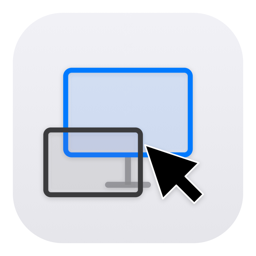

<div align="center">



# MouseOn

**Never lose your cursor again.**

A tiny macOS menu bar app that always tells you which display your mouse is on — and finds it for you when it hides.

[](https://github.com/Omarabiakar18/MouseOn/actions/workflows/ci.yml)
[](https://github.com/Omarabiakar18/MouseOn/releases/latest)
[](#requirements)
[](LICENSE)

</div>

---

## The problem

You have a MacBook, an external monitor, and maybe an iPad running Sidecar. You go to click something and the cursor is... somewhere. So you shake the mouse. Every day, a hundred times a day.

MouseOn puts the name of the display your cursor is on right in your menu bar, and gives you a hotkey that highlights the cursor wherever it ended up.

<!--
  SCREENSHOTS — replace these placeholders with real images.
  Suggested: create a docs/screenshots/ folder and drop in
    menubar.png   — the menu bar item showing a display name
    highlight.png — Find My Cursor mid-animation
    settings.png  — the Settings window with custom aliases
    stats.png     — the usage statistics view
-->

## Features

**Know where you are**
- Display name in the menu bar, updated as the cursor moves
- Detects **Universal Control** (cursor on your iPad) and **Sidecar** displays
- Flags mirrored displays, and shows every connected display with its technical details

**Find your cursor**
- **Find My Cursor** — an animated highlight, on ⌥⌘F
- **Large Cursor** — temporarily blow the cursor up, on ⌥⌘L
- Both are colour- and duration-configurable

**Make it yours**
- Custom alias per display — emoji work (🖥️ 💻 📱)
- Custom menu bar colour per display
- Emoji-only mode, name length limits, and opacity for a quieter menu bar
- Auto-hide the menu bar item until you move the mouse

**Everything else**
- Usage statistics — how long you spend on each display
- Five [Shortcuts](#shortcuts-integration) actions for automations
- VoiceOver announcements on display change
- Launch at login
- Battery-aware polling, so it backs off on battery power

## Install

### Download

Grab the latest `.dmg` from the [**Releases**](https://github.com/Omarabiakar18/MouseOn/releases/latest) page, open it, and drag MouseOn into Applications.

> **First launch:** MouseOn isn't notarized (that needs a paid Apple Developer account), so macOS will refuse to open it on the first try. Right-click the app → **Open** → **Open**. You only do this once.

Every release ships a `SHA256SUMS.txt`. To check your download:

```bash
shasum -a 256 -c SHA256SUMS.txt
```

### Build from source

```bash
git clone https://github.com/Omarabiakar18/MouseOn.git
cd MouseOn
open MouseOn.xcodeproj
```

Then ⌘R. Or from the command line:

```bash
xcodebuild build -project MouseOn.xcodeproj -scheme MouseOn -configuration Release \
  -destination 'platform=macOS,arch=arm64' CODE_SIGN_IDENTITY="-" CODE_SIGNING_REQUIRED=NO
```

## Permissions

MouseOn asks for **Accessibility** access (System Settings → Privacy & Security → Accessibility). It needs this to watch for the global hotkeys and to track the cursor while other apps are focused. Everything except the hotkeys works without it.

## Keyboard shortcuts

| Shortcut | Action |
|----------|--------|
| <kbd>⌥</kbd><kbd>⌘</kbd><kbd>F</kbd> | Find My Cursor — highlight the cursor where it is |
| <kbd>⌥</kbd><kbd>⌘</kbd><kbd>L</kbd> | Large Cursor — temporarily enlarge the cursor |

Both can be turned off in Settings.

## Shortcuts integration

MouseOn exposes five actions to the Shortcuts app, so you can wire it into your own automations:

| Action | What it does |
|--------|--------------|
| Find My Cursor | Triggers the highlight animation |
| Show Large Cursor | Triggers large cursor mode |
| Get Current Display | Returns the name of the display the cursor is on |
| List Connected Displays | Returns every connected display |
| Move Cursor to Display | Jumps the cursor to a named display |

## Privacy

MouseOn collects nothing. No analytics, no telemetry, no accounts, no crash reporting.

Usage statistics stay in a JSON file in your own Application Support folder and never leave your Mac. The app makes exactly one kind of network request: a check against the GitHub Releases API for a new version, every six hours. Downloaded updates are verified against the release's published SHA-256 before they're opened.

## Requirements

- macOS 13.0 (Ventura) or later
- No dependencies — pure Apple frameworks

## Contributing

Issues and pull requests are welcome. See [CONTRIBUTING.md](CONTRIBUTING.md) for how to build, test, and lint, and [FEATURES.md](FEATURES.md) for what's planned.

## License

[MIT](LICENSE) © Omar Abi Akar
